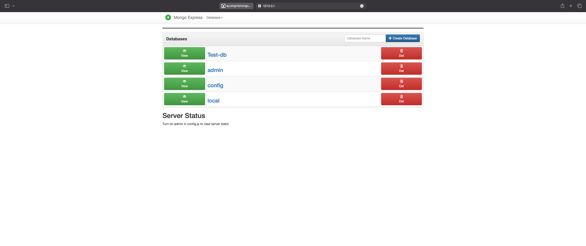

<a name="readme-top"></a>

<!-- PROJECT LOGO -->
<br />
<div align="center">
  <a href="https://github.com/ayushgml/mongo-on-k8s">
  
  </a>

  <h1 align="center">Mongo Application deployemnt on Kubernetes</h1>

  <p align="center">
    Application deployment of Mongo and Mongo-express serives on Kubernetes
</div>

<!-- ABOUT THE PROJECT -->
## About The Project
<div align="center">
</div>
This project creates 2 Deployment/Pods, one for Mongo and one for Mongo-express. Mongo-express is a web-based MongoDB admin interface written with Node.js, Express and Bootstrap3. It is part of the MongoDB ecosystem, and supports the current version of MongoDB.
<br>
2 services are also created - mongodb is an internal service and mongo-express is an Loadbalancer (external service). The external service is exposed on port 30000 of the host machine. No external requests are allowed to the internal service.
<br>
1 secret and 1 configmap are also created. The secret is used to store the password for the mongodb root user. The configmap is used to store the environment variables for the mongo-express pod.


<!-- GETTING STARTED -->
## Request flow from browser

1. User enters the IP address of the host machine and port 30000 in the browser.
2. The request is forwarded to the mongo-express service.
3. This will forward it to mongo-expess pod.
4. The pod will then connect to the internal service mongodb.
5. The mongodb service will then connect to the mongodb pod.

## Prerequisites
1. Docker insalled on the host machine.
2. Minikube installed and running on the host machine.

## Installation
1. Clone the repo
   ```sh
   git clone https://github.com/ayushgml/mongo-on-k8s
    ```
2. Change directory
    ```sh
    cd mongo-on-k8s
    ```
3. Create mongo-secret
    ```sh
    kubectl create -f mongo-secret.yaml
    ```
4. Create mongo service and deployment(both are in the same file)
    ```sh
    kubectl create -f mongo.yaml
    ```
5. Create mongo-express configmap
    ```sh
    kubectl create -f mongo-configmap.yaml
    ```
6. Create mongo-express service and deployment(both are in the same file)
    ```sh
    kubectl create -f mongo-express.yaml
    ```
7. Wait for the pods to be in running state
    ```sh
    kubectl get pods
    ```

## Usage
1. Minikube requires an extra command to run on your host machine
    ```sh
    minikube service mongo-express-service
    ```
    This will open the mongo-express service in the default browser of the host machine!

    


<!-- CONTACT -->
## Contact

Ayush Gupta - [@itsayush__](https://twitter.com/itsayush__) - ayushgml@gmail.com

Project Link: [https://github.com/ayushgml/mongo-on-k8s](https://github.com/ayushgml/mongo-on-k8s)


